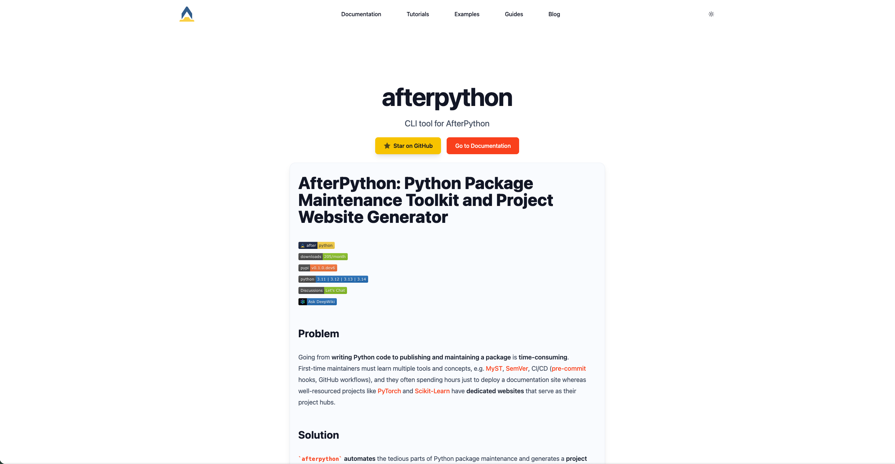

# AfterPython: Python Package Maintenance Toolkit and Project Website Generator

[](https://afterpython.org)
[](https://pepy.tech/project/afterpython)
[](https://pypi.org/project/afterpython)

[](https://github.com/AfterPythonOrg/afterpython/discussions)
[](https://deepwiki.com/AfterPythonOrg/afterpython)
[](https://codewiki.google/github.com/afterpythonorg/afterpython?utm_source=badge&utm_medium=github&utm_campaign=github.com/afterpythonorg/afterpython)
<!--  -->
<!-- [](https://pixi.sh) -->


[MyST]: https://mystmd.org
[MyST Markdown]: https://mystmd.org/spec/
[Jupyter Notebook]: https://jupyter.org
[pre-commit]: https://pre-commit.com
[pagefind]: https://pagefind.app
[SemVer]: https://semver.org
[great-docs]: https://posit-dev.github.io/great-docs/
[GitHub Actions]: https://github.com/features/actions
[PyTorch]: https://pytorch.org
[Scikit-Learn]: https://scikit-learn.org
[WebLLM]: https://webllm.mlc.ai/
[project-website-template]: https://github.com/AfterPythonOrg/project-website-template
[commitizen]: https://github.com/commitizen-tools/commitizen
[uv]: https://docs.astral.sh/uv/
[ruff]: https://docs.astral.sh/ruff/


## Problem
Going from **writing Python code to publishing and maintaining a package** is **time-consuming**.
First-time maintainers must learn multiple tools and concepts, e.g. [MyST], [SemVer], CI/CD ([pre-commit] hooks, GitHub workflows), and they often spend hours just to deploy a documentation site whereas well-resourced projects like [PyTorch] and [Scikit-Learn] have **dedicated websites** that serve as their project hubs.


## Solution
`afterpython` **automates** the tedious parts of Python package maintenance and generates a **project website** for **building community** and **hosting content** such as documentation, **blog posts**, tutorials, examples and more — empowering more developers to write packages with ease.

---
`afterpython` is a CLI tool that **abstracts away the complexity** of **content writing, website deployment, and package release/maintenance** by providing an opinionated set of modern tools — so you don’t have to spend time selecting or learning anything beyond the basics.


## Core Features
- [x] Write content directly in [MyST Markdown] or [Jupyter Notebook]
- [x] Go from writing to **website deployment in minutes** — no need to learn any of the underlying tools
- [x] Centralize all your content in a modern, **unified project website** — from documentation to blog posts
- [x] Zero-config orchestration — Pre-configured modern tooling with sane defaults (see [Tech Stack](#tech-stack)), so you can start maintaining packages immediately **without learning each tool**
- [x] **⚡ Full-text search** across **ALL** your content in your website — docs, blogs, tutorials, everything
- [ ] Export content as PDF — for example, combine all blog posts into a single PDF file
- [ ] **🤖 Embedded AI Chatbot** that answers questions directly using an in-browser LLM — at no cost

---
## Project Website
> The project website for `afterpython` is created using `afterpython` itself. See the [**website**](https://afterpython.afterpython.org).
<picture>
  <source media="(prefers-color-scheme: dark)" srcset="afterpython/static/website-dark.png">
  <source media="(prefers-color-scheme: light)" srcset="afterpython/static/website-light.png">
  
</picture>

You can create your own website too and deploy it to GitHub Pages in **less than a minute**! See [Quickstart](https://afterpython.afterpython.org/doc/quickstart).

---
## Installation
```bash
# install afterpython as a dev dependency
uv add --dev afterpython

# initialize afterpython
ap init
```


---
## CLI Commands
```bash
# show all commands
ap --help

# or use terminal UI (TUI)
ap tui
```


---
## Tech Stack
- [MyST]
- [project-website-template]
- [pre-commit]
- [GitHub Actions]
- [great-docs]
- [commitizen]
- [uv]
- [ruff]
- [pagefind]
- [WebLLM]
<!-- - ty -->
<!-- - [pixi] -->
