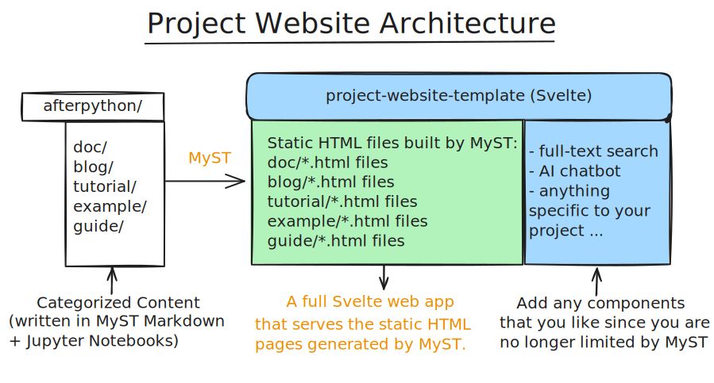

[project-website-template]: https://github.com/AfterPythonOrg/project-website-template
[MyST]: https://mystmd.org
[pdoc]: https://pdoc.dev/docs/pdoc.html
[PyPI]: https://pypi.org/
[WebLLM]: https://webllm.mlc.ai/
[PageFind]: https://pagefind.app/
[Svelte]: https://svelte.dev/
[NodeJS]: https://nodejs.org
[pnpm]: https://www.npmjs.com/package/pnpm

# Project Website

> The project website for `afterpython` is created using `afterpython` itself. See the [**website**](https://afterpython.afterpython.org).

## Definition
On [PyPI], you typically see three urls under **Project Links**,
and they are defined in the `[project.urls]` section of `pyproject.toml`.
Most projects that are not backed by a company either omit the homepage field,
or reuse the documentation URL as the homepage, even though it already has its own link.

:::{figure} ./static/homepage.png
:width: 36%
:alt: PyPI homepage button

PyPI homepage button
:::

Here is where `afterpython` comes to the rescue:

It **automatically generates a project website that serves as the `homepage`** for every Python project,
allowing even small, resource-constrained projects to have a dedicated website.
Essentially, it **extends your documentation site into a fully featured website**.

---
## Architecture
:::{div}
:class: dark:hidden

:::

:::{div}
:class: hidden dark:block

:::

During `ap init`, `afterpython` creates a new directory `afterpython/_website/` and initializes it with [project-website-template], which uses [Svelte] and SvelteKit to create the project website and serve the HTML files built by `mystmd` in all of the content folders in `afterpython/` (e.g., `afterpython/doc/`, `afterpython/blog/`)

This approach brings us into the realm of full-stack web development, which enables us to add features such as an AI chatbot, full-text search engine across the website, etc.


---
## Website Template Update
[project-website-template] is a separate repository that will be updated independently of `afterpython` to provide new features and bug fixes for the project website.

When updates are available, run `ap update website`, which will update `afterpython/_website`, and you can start using the new features immediately.


:::{warning} Caveat
`ap update website` will overwrite the existing `afterpython/_website` with the latest [project-website-template]. If you have made any customizations to `afterpython/_website`, they will be lost.
:::


---
## Customization and Styling
Since all the code is pulled from [project-website-template] to `afterpython/_website/`, you can customize the project website by modifying the code in `afterpython/_website/src/`.


### Landing Page
For example, to change the landing page, which by default displays the `README.md`, you can modify the code in `afterpython/_website/src/routes/+page.svelte`.

> If you don't know Svelte and are using an LLM to code for you, remember to ask it to write in Svelte 5 syntax.

### Static Files
All static files (e.g. `logo.svg`, `favicon.svg`, images, css files, etc.) should be put in the `afterpython/static/` directory.
They will be automatically copied to the `afterpython/_website/static/` directory during `ap build`.

#### Content-Type-Specific Static Files
In addition to the global `afterpython/static/` directory, each content type can have its own `static/` folder for content-specific assets:

- `afterpython/blog/static/` - Static files specific to blog posts (e.g., thumbnail images, blog-specific graphics)
- `afterpython/tutorial/static/` - Static files specific to tutorials
- `afterpython/doc/static/` - Static files specific to documentation

This organization helps keep content-related assets close to their source files. For example, if you have thumbnail images for your blog posts, place them in `afterpython/blog/static/` rather than mixing them with global assets in `afterpython/static/`.

---
## Content Type Configuration
Each content type (blog, tutorial, etc.) has a listing page that displays all posts of that type. You can customize these listing pages in `afterpython.toml`.

:::{note}
This configuration applies to all non-doc content types. Documentation (`doc`) does not have a listing page, so these settings don't apply to it.
:::

### Default Thumbnails
Set a default thumbnail image for all posts within a content type:

```toml
[website.blog]
thumbnail = "blog_default_thumbnail.png"
```

The thumbnail path is **relative to the content type's static folder**. In this example, `afterpython` will look for `afterpython/blog/static/blog_default_thumbnail.png`.

This default thumbnail will be used for any blog post that doesn't specify its own thumbnail.

:::{tip} Override Thumbnails Per Post
You can override the default thumbnail for individual posts using MyST [frontmatter](https://mystmd.org/guide/frontmatter#available-frontmatter-fields). Add this to the top of your markdown file:

```markdown
---
title: My Blog Post Title
description: A brief description of this post
thumbnail: custom_thumbnail.png  # Specific thumbnail for this post
---
```

This also works for Jupyter Notebooks - just add the frontmatter in the first cell as markdown.
:::

### Featured Post
Specify which post appears in the featured/hero section of the listing page:

```toml
[website.blog]
featured_post = "blog1.md"
```

This will display `blog1.md` prominently in the hero section when users visit the blog listing page.

### Example Configuration
Here's a complete example for blog posts:

```toml
[website.blog]
thumbnail = "blog_default_thumbnail.png"  # Default thumbnail for all blog posts
featured_post = "announcing-v1.md"        # Featured post in hero section
```

The same configuration works for other content types:

```toml
[website.tutorial]
thumbnail = "tutorial_default_thumbnail.png"
featured_post = "getting-started.md"
```

---
## 🚧 Built-in Features
- full-text search using [PageFind]
- AI chatbot using [WebLLM]

### API Reference
[pdoc]  will be used to build the API Reference section on the project website.

### FAQs
`faq.yml` will be used as content for the FAQs section on the project website.

### Google Analytics
add google analytics support for the entire website

### Compatibility
Currently `afterpython` only supports content built `mystmd`. It does NOT work with Sphinx, MkDocs etc.
