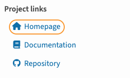

[project-website-template]: https://github.com/AfterPythonOrg/project-website-template
[MyST]: https://mystmd.org
[pdoc]: https://pdoc.dev/docs/pdoc.html
[PyPI]: https://pypi.org/
[WebLLM]: https://webllm.mlc.ai/
[PageFind]: https://pagefind.app/
[Svelte]: https://svelte.dev/
[NodeJS]: https://nodejs.org
[pnpm]: https://www.npmjs.com/package/pnpm

# Project Website

> The project website for `afterpython` is created using `afterpython` itself. See the [**website**](https://afterpython.afterpython.org).

## Definition
On [PyPI], you typically see three urls under **Project Links**,
and they are defined in the `[project.urls]` section of `pyproject.toml`.
Most projects that are not backed by a company either omit the homepage field,
or reuse the documentation URL as the homepage, even though it already has its own link.

Here is where `afterpython` comes to the rescue:

It **automatically generates a project website that serves as the `homepage`** for every Python project,
allowing even small, resource-constrained projects to have a dedicated website.
Essentially, it **extends your documentation site into a fully featured website**.

---
## Architecture
:::{div}
:class: dark:hidden

:::

:::{div}
:class: hidden dark:block

:::

During `ap init`, `afterpython` creates a new directory `afterpython/_website/` and initializes it with [project-website-template], which uses [Svelte] and SvelteKit to create the project website and serve the HTML files built by `mystmd` in all of the content folders in `afterpython/` (e.g., `afterpython/doc/`, `afterpython/blog/`)

This approach brings us into the realm of full-stack web development, which enables us to add features such as an AI chatbot, full-text search engine across the website, etc.

---
## Website Template Update
[project-website-template] is a separate repository that will be updated independently of `afterpython` to provide new features and bug fixes for the project website.

When updates are available, run `ap update website`, which will update `afterpython/_website`, and you can start using the new features immediately.

:::{warning} Caveat
`ap update website` will overwrite the existing `afterpython/_website` with the latest [project-website-template]. If you have made any customizations to `afterpython/_website`, they will be lost.
:::

---
## Customization and Styling
Since all the code is pulled from [project-website-template] to `afterpython/_website/`, you can customize the project website by modifying the code in `afterpython/_website/src/`.

For example, to change the landing page, which by default displays the `README.md`, you can modify the code in `afterpython/_website/src/routes/+page.svelte`.

> If you don't know Svelte and are using an LLM to code for you, remember to ask it to write in Svelte 5 syntax.

---
## Work in Progress 🚧
## Built-in Features
- full-text search using [PageFind]
- AI chatbot using [WebLLM]

### API Reference
[pdoc]  will be used to build the API Reference section on the project website.

### FAQs
`faq.yml` will be used as content for the FAQs section on the project website.

### Google Analytics
add google analytics support for the entire website

### Compatibility
Currently `afterpython` only supports content built `mystmd`. It does NOT work with Sphinx, MkDocs etc.
